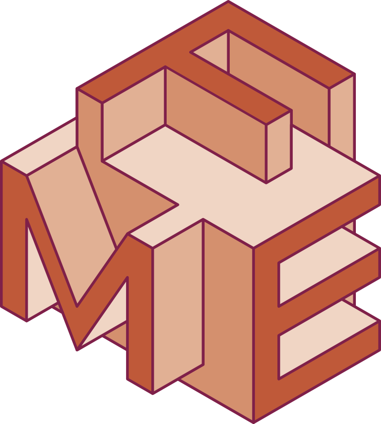
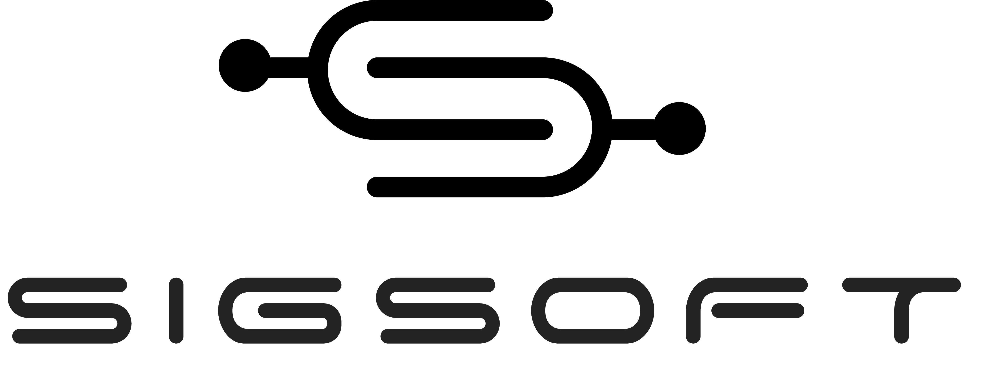
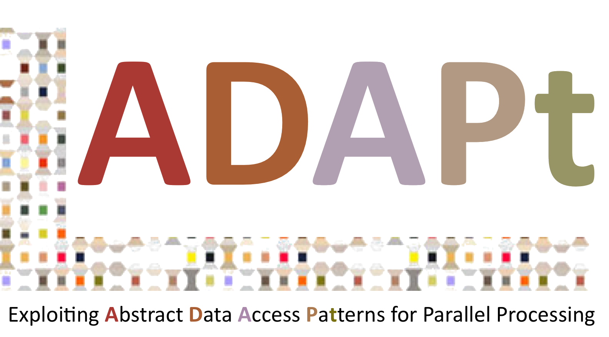

<!--
# Welcome to ICTAC 2023!

The 20th International Colloquium on Theoretical Aspects of Computing will
take place in Lima - Peru, on 04-08 December 2023. ICTAC 2023 will be
hosted by UTEC, Lima - Peru.
 -->
### News: Check the program for the ICTAC 2023 main conference!

We have 22 accepted papers at ICTAC 2023, which will be presented during the main conference. Check the ICTAC 2023 [full program](https://ictac2023.compsust.utec.edu.pe/program_ICTAC/) and the [main conference program](https://easychair.org/smart-program/ICTAC2023/){:target="_blank"}!

### News: Check the invited speakers, lecturers and tutorials at ICTAC 2023!

We are excited to announce our [invited speakers](https://ictac2023.compsust.utec.edu.pe/speakers/){:target="_blank"}  at ICTAC 2023: Marijn J.H. Heule  from Carnegie Mellon University - USA,  Ana Cavalcanti  from the University of York - UK and Pedro R. D'Argenio from the National University of Córdoba - Argentina.  These recognized speakers will also give a lecture at the [training school](https://ictac2023.compsust.utec.edu.pe/school/){:target="_blank"}. Christian Colombo from the University of Malta will also give a lecture at the training school. We also have a number of interesting [tutorials](https://ictac2023.compsust.utec.edu.pe/tutorials/){:target="_blank"}.

Stay tuned! More details about the topics will be announced soon!
 
<!-- ### News: deadline extended and special issue journal 

- The submission deadline for ICTAC has been extended by two weeks. __New firm 
  deadlines are 25 June (abstract) and 02 July (papers).__ However, authors are 
  encouraged to submit abstracts as soon as possible to ease the planning of 
  the reviewing process.

- Authors of a selected subset of accepted papers will be invited to submit
  an extended version of their papers to a special issue in the journal
  Theoretical Computer Science (TCS):
  https://www.sciencedirect.com/journal/theoretical-computer-science  -->
 
### About protests in Peru.
 
We are continuously monitoring the political situation in Peru, which faced violent protests in 2022 also affecting travelers. To the best of our knowledge, this situation has calmed down. If protests erupt again, we will work closely with the ICTAC Steering Committee to choose the best feasible solution.
 
Lima - Peru, May 2023

## Important dates

 - __Abstract deadline:__  25 June 2023 (AoE)
 - __Submission deadline:__ ~~16 June 2023~~ 02 July 2023 (AoE)
 - __Notification:__ 10 September 2023 (AoE)
 - __Camera ready:__  25 September 2023 (AoE) 

# About ICTAC

The International Colloquium on Theoretical Aspects of Computing ([ICTAC](https://ictac.isp.uni-luebeck.de/about){:target="_blank"}) was founded in 2004. It takes place every year preferably in a developing country. The aim of the colloquium is to bring together practitioners and researchers from academia, industry and government to present research results, and exchange experience, ideas, and solutions for their problems in theoretical aspects of computing. Beyond these scholarly goals, another main purpose of the conference is to promote cooperation in research and education between participants and their institutions, from developing and industrial countries.

### Past Editions

- [See ICTAC webpage](https://ictac.isp.uni-luebeck.de/previous-events){:target="_blank"}

# Sponsors

{:style="text-align:center;"}
{:target="blank"}
{:target="blank"}

{:style="text-align:center;"}
{:target="blank"}
<!-- {:target="blank"}  -->
{:target="blank"}
{:target="blank"}

