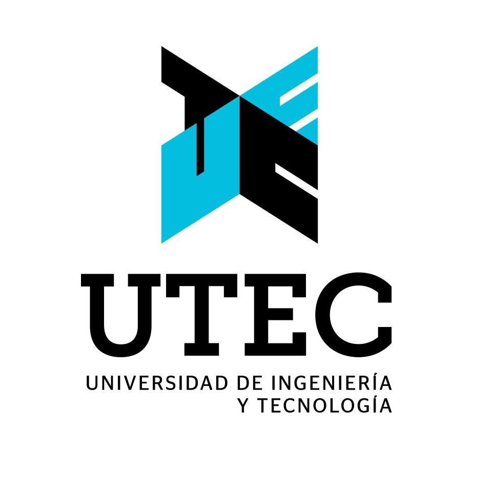

<!--
# Welcome to ICTAC 2023!

The 20th International Colloquium on Theoretical Aspects of Computing will
take place in Lima - Peru, on 04-08 December 2023. ICTAC 2023 will be
hosted by UTEC, Lima - Peru.
 -->
### About protests in Peru.
 
As ICTAC 2023 organisers, we are aware of the current political situation in Peru and the protests that have been happening in the country. We want to let you know that at the moment protests in Lima are sporadic and pacific and its air and land communication routes are operative. Currently we continue our plan to organise ICTAC physically at UTEC. If the situation changes and this is no longer the case, we will work closely with the ICTAC Steering Committee to choose the best feasible solution.
 
Lima - Peru, March 2023

## Important dates

 - __Submission deadline:__ 16 June 2023 (AoE)
 - __Notification:__ 10 September 2023 (AoE)
 - __Camera ready:__  25 September 2023 (AoE) 

# About ICTAC

The International Colloquium on Theoretical Aspects of Computing ([ICTAC](https://ictac.isp.uni-luebeck.de/about){:target="_blank"}) was founded in 2004. It takes place every year preferably in a developing country. The aim of the colloquium is to bring together practitioners and researchers from academia, industry and government to present research results, and exchange experience, ideas, and solutions for their problems in theoretical aspects of computing. Beyond these scholarly goals, another main purpose of the conference is to promote cooperation in research and education between participants and their institutions, from developing and industrial countries.

### Past Editions

- [See ICTAC webpage](https://ictac.isp.uni-luebeck.de/previous-events){:target="_blank"}

# Sponsors

{:style="text-align:center;"}
{:target="blank"}
{:target="blank"}
{:target="blank"}

